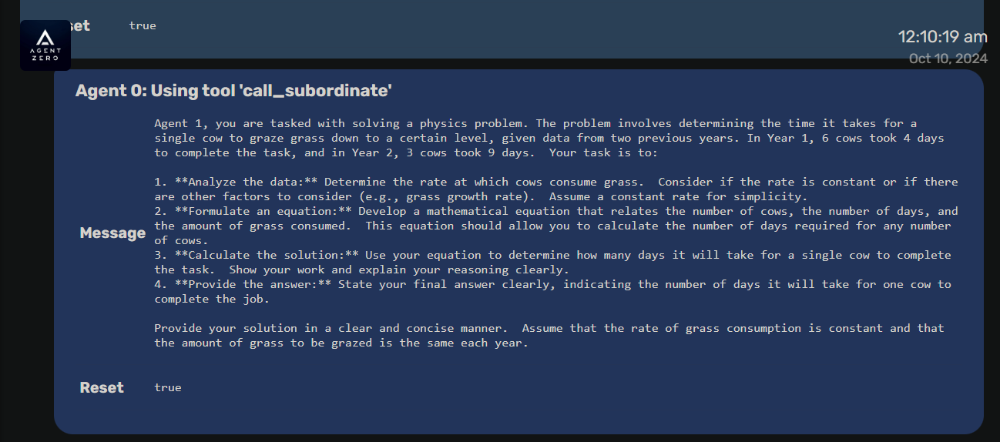
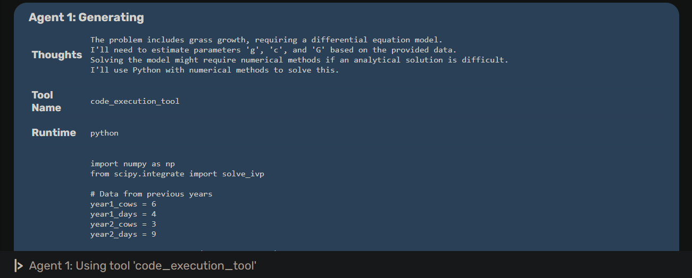
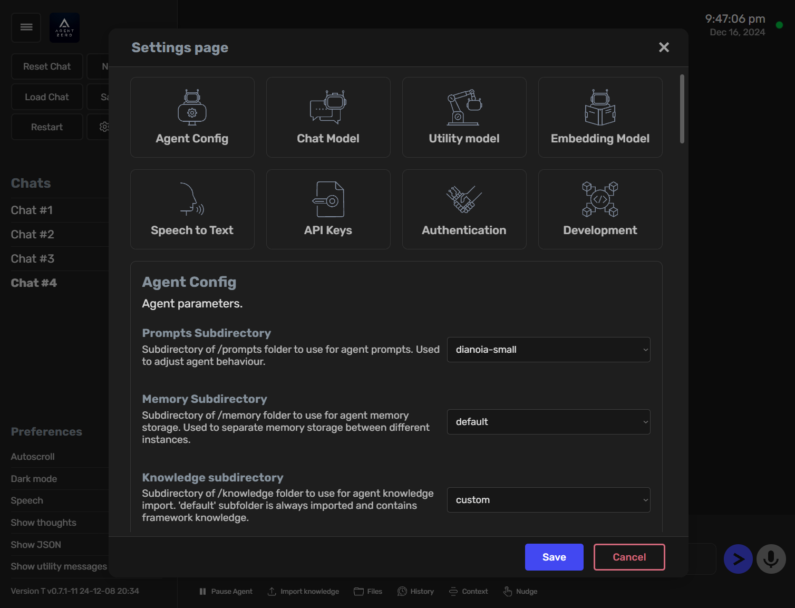

<div align="center">


# `Agent Zero`

[](https://github.com/sponsors/frdel) [](https://www.skool.com/agent-zero) [](https://discord.gg/B8KZKNsPpj) [](https://www.youtube.com/@AgentZeroFW) [](https://www.linkedin.com/in/jan-tomasek/) [](https://warpcast.com/agent-zero)

> **குறிப்பு:** Agent Zero Twitter/X ஐப் பயன்படுத்துவதில்லை. இந்தப் திட்டத்தைப் பிரதிநிதித்துவப்படுத்துவதாகக் கூறும் எந்த Twitter/X கணக்குகளும் போலியானவை.

[நிறுவல்](./docs/installation.md) •
[எப்படிப் புதுப்பிப்பது](./docs/installation.md#how-to-update-agent-zero) •
[ஆவணங்கள்](./docs/README.md) •
[பயன்பாடு](./docs/usage.md)

</div>


[](https://youtu.be/lazLNcEYsiQ)


மேலும் தகவலுக்கு [www.agent-zero.ai](https://agent-zero.ai) ஐப் பார்க்கவும்

[](https://agent-zero.ai)


> [!குறிப்பு]
> **🎉 v0.8.1 வெளியீடு**: இப்போது Chromium ஐ வலை இடைவினைகளுக்குப் பயன்படுத்தக்கூடிய உலாவி முகவரைக் கொண்டுள்ளது! இது Agent Zero க்கு வலை உலாவவும், தகவல்களைச் சேகரிக்கவும், வலை உள்ளடக்கத்துடன் தன்னாட்சியாக தொடர்பு கொள்ளவும் உதவுகிறது.


https://github.com/user-attachments/assets/c168759d-57d8-4b43-b62a-1026afcf52e6

## உங்களுடன் வளர்ந்து கற்றுக்கொள்ளும் ஒரு தனிப்பட்ட, கரிம முகவர் கட்டமைப்பு

- Agent Zero ஒரு முன்வரையறுக்கப்பட்ட முகவர் கட்டமைப்பு அல்ல. இது மாறும் வகையில், உங்களுடன் இணைந்து வளரவும் கற்கவும் வடிவமைக்கப்பட்டுள்ளது.
- Agent Zero முற்றிலும் வெளிப்படையானது, படிக்கக்கூடியது, புரிந்துகொள்ளக்கூடியது, தனிப்பயனாக்கக்கூடியது மற்றும் ஊடாடும் தன்மை கொண்டது.
- Agent Zero கணினியை அதன் (உங்கள்) பணிகளைச் செய்ய ஒரு கருவியாகப் பயன்படுத்துகிறது.

# 💡 முக்கிய அம்சங்கள்

1. **பொது நோக்கக் கைகாட்டி**

- Agent Zero குறிப்பிட்ட பணிகளுக்காக முன் திட்டமிடப்படவில்லை (ஆனால் செய்ய முடியும்). இது ஒரு பொது நோக்கத்திற்கான தனிப்பட்ட உதவியாளராகும். அதற்கு ஒரு பணியைக் கொடுங்கள், அது தகவல்களைச் சேகரிக்கும், கட்டளைகளையும் குறியீட்டையும் செயல்படுத்தும், பிற முகவர் நிகழ்வுகளுடன் ஒத்துழைக்கும், மேலும் அதைச் செய்ய தன்னால் முடிந்ததைச் செய்யும்.
- இது ஒரு நிரந்தர நினைவகத்தைக் கொண்டுள்ளது, இது முந்தைய தீர்வுகள், குறியீடு, உண்மைகள், வழிமுறைகள் போன்றவற்றை நினைவில் வைத்துக் கொள்ள உதவுகிறது, இதனால் எதிர்காலத்தில் பணிகளை விரைவாகவும் நம்பகத்தன்மையுடனும் தீர்க்க முடியும்.


2. **கருவியாகக் கணினி**

- Agent Zero அதன் பணிகளைச் செய்ய இயக்க முறைமையை ஒரு கருவியாகப் பயன்படுத்துகிறது. இதற்கு முன் திட்டமிடப்பட்ட ஒரே ஒரு நோக்கத்திற்கான கருவிகள் இல்லை. அதற்கு பதிலாக, அது தனது சொந்தக் குறியீட்டை எழுதி, தேவைக்கேற்ப தனது சொந்தக் கருவிகளை உருவாக்கவும் பயன்படுத்தவும் டெர்மினலைப் பயன்படுத்தலாம்.
- அதன் ஆயுதக் களஞ்சியத்தில் உள்ள ஒரே இயல்புநிலை கருவிகள் ஆன்லைன் தேடல், நினைவக அம்சங்கள், தொடர்பு (பயனர் மற்றும் பிற முகவர்களுடன்) மற்றும் குறியீடு/டெர்மினல் செயல்படுத்துதல். மற்ற அனைத்தும் முகவரால் தானாகவே உருவாக்கப்படுகின்றன அல்லது பயனரால் விரிவாக்கப்படலாம்.
- மிகச் சிறிய மாதிரிகளிலும் கூட, கருவி பயன்பாட்டுச் செயல்பாடு முதல் முறையாக உருவாக்கப்பட்டு, அதிக இணக்கத்தன்மை மற்றும் நம்பகத்தன்மையுடன் உருவாக்கப்பட்டுள்ளது.
- **இயல்புநிலை கருவிகள்:** Agent Zero ஆனது அறிவு, வலைப்பக்க உள்ளடக்கம், குறியீடு செயல்படுத்துதல் மற்றும் தொடர்பு போன்ற கருவிகளை உள்ளடக்கியது.
- **தனிப்பயன் கருவிகளை உருவாக்குதல்:** உங்கள் சொந்த தனிப்பயன் கருவிகளை உருவாக்குவதன் மூலம் Agent Zero இன் செயல்பாட்டை விரிவாக்குங்கள்.
- **கருவிகள்:** கருவிகள் ஒரு புதிய வகைக் கருவியாகும், இது Agent Zero ஆல் அழைக்கப்படக்கூடிய தனிப்பயன் செயல்பாடுகளையும் நடைமுறைகளையும் உருவாக்க உங்களை அனுமதிக்கிறது.

3. **பல முகவர் ஒத்துழைப்பு**

- ஒவ்வொரு முகவருக்கும் ஒரு உயர்ந்த முகவர் பணிகள் மற்றும் வழிமுறைகளை வழங்குகிறார். ஒவ்வொரு முகவரும் பின்னர் அதன் உயர் அதிகாரியிடம் அறிக்கை செய்கிறார்.
- சங்கிலியில் உள்ள முதல் முகவரின் (Agent 0) விஷயத்தில், உயர் அதிகாரி மனித பயனர்; முகவர் எந்த வித்தியாசத்தையும் காணவில்லை.
- ஒவ்வொரு முகவரும் துணைப் பணிகளைப் பிரித்து தீர்க்க உதவும் அதன் துணை முகவரைக் உருவாக்கலாம். இது அனைத்து முகவர்களுக்கும் தங்கள் சூழலைத் தெளிவாகவும் கவனமாகவும் வைத்திருக்க உதவுகிறது.




4. **முற்றிலும் தனிப்பயனாக்கக்கூடியது மற்றும் விரிவாக்கக்கூடியது**

- இந்த கட்டமைப்பில் கிட்டத்தட்ட எதுவும் ஹார்டு-கோட் செய்யப்படவில்லை. எதுவும் மறைக்கப்படவில்லை. எல்லாம் பயனரால் விரிவாக்கப்படலாம் அல்லது மாற்றப்படலாம்.
- முழு நடத்தையும் **prompts/default/agent.system.md** கோப்பில் உள்ள ஒரு கணினி ப்ராம்ட் மூலம் வரையறுக்கப்படுகிறது. இந்த ப்ராம்ட்டை மாற்றினால், கட்டமைப்பு வியத்தகு முறையில் மாறும்.
- கட்டமைப்பு எந்த வகையிலும் முகவரை வழிநடத்தவோ அல்லது கட்டுப்படுத்தவோ இல்லை. முகவர்கள் பின்பற்ற வேண்டிய கடினமான குறியிடப்பட்ட தடங்கள் எதுவும் இல்லை.
- முகவர் அதன் தொடர்பு சுழற்சியில் அனுப்பப்படும் ஒவ்வொரு ப்ராம்ட், ஒவ்வொரு சிறிய செய்தி வார்ப்புருவும் **prompts/** கோப்புறையில் காணலாம் மற்றும் மாற்றலாம்.
- ஒவ்வொரு இயல்புநிலை கருவியும் **python/tools/** கோப்புறையில் காணலாம் மற்றும் மாற்றலாம் அல்லது புதிய முன்வரையறுக்கப்பட்ட கருவிகளை உருவாக்க நகலெடுக்கலாம்.


5. **தொடர்பு முக்கியமானது**

- உங்கள் முகவருக்கு சரியான கணினி ப்ராம்ட் மற்றும் வழிமுறைகளை வழங்குங்கள், அது அதிசயங்களைச் செய்ய முடியும்.
- முகவர்கள் தங்கள் உயர் அதிகாரிகளுடனும் துணை அதிகாரிகளுடனும் தொடர்பு கொள்ளலாம், கேள்விகளைக் கேட்கலாம், வழிமுறைகளை வழங்கலாம் மற்றும் வழிகாட்டுதலை வழங்கலாம். கணினி ப்ராம்ட்டில் உங்கள் முகவர்களுக்கு எவ்வாறு திறம்பட தொடர்பு கொள்ள வேண்டும் என்று அறிவுறுத்துங்கள்.
- டெர்மினல் இடைமுகம் உண்மையான நேரத்தில் ஒளிபரப்பப்பட்டு ஊடாடும் தன்மை கொண்டது. எந்த நேரத்திலும் நீங்கள் நிறுத்தி தலையிடலாம். உங்கள் முகவர் தவறான திசையில் செல்வதைக் கண்டால், உடனடியாக நிறுத்தி அதைக் கூறுங்கள்.
- இந்த கட்டமைப்பில் நிறைய சுதந்திரம் உள்ளது. உங்கள் முகவர்களுக்கு தொடர அனுமதி கோரி உயர் அதிகாரிகளுக்கு தொடர்ந்து அறிக்கை செய்யுமாறு அறிவுறுத்தலாம். துணைப் பணிகளை ஒப்படைக்க எப்போது முடிவு செய்ய வேண்டும் என்பதை தீர்மானிக்கும்போது புள்ளிகள் மதிப்பெண் முறைகளைப் பயன்படுத்துமாறு அவர்களுக்கு அறிவுறுத்தலாம். உயர் அதிகாரிகள் துணை அதிகாரிகளின் முடிவுகளை மீண்டும் சரிபார்த்து சண்டையிடலாம். சாத்தியங்கள் முடிவற்றவை.

## 🚀 Agent Zero உடன் நீங்கள் உருவாக்கக்கூடிய விஷயங்கள்

- **மேம்பாட்டு திட்டங்கள்** - `"நிகழ்நேர தரவு காட்சிப்படுத்தலுடன் ஒரு React டாஷ்போர்டை உருவாக்கவும்"`

- **தரவு பகுப்பாய்வு** - `"கடந்த காலாண்டின் NVIDIA விற்பனைத் தரவை பகுப்பாய்வு செய்து போக்கு அறிக்கைகளை உருவாக்கவும்"`

- **உள்ளடக்க உருவாக்கம்** - `"மைக்ரோசர்வீஸ்கள் பற்றிய ஒரு தொழில்நுட்ப வலைப்பதிவு இடுகையை எழுதவும்"`

- **சிஸ்டம் அட்மின்** - `"எங்கள் வலைச் சேவையகங்களுக்கான கண்காணிப்பு அமைப்பை அமைக்கவும்"`

- **ஆராய்ச்சி** - `"CoT ப்ராம்டிங் பற்றிய ஐந்து சமீபத்திய AI கட்டுரைகளைச் சேகரித்து சுருக்கவும்"`

# ⚙️ நிறுவல்

Agent Zero ஐ எவ்வாறு நிறுவுவது என்பதை அறிய ஒரு வீடியோவைத் திறக்க கிளிக் செய்யவும்:

[](https://www.youtube.com/watch?v=cHDCCSr1YRI&t=24s)

Windows, macOS மற்றும் Linux க்கான விரிவான அமைவு வழிகாட்டி (ஒரு வீடியோவுடன்) Agent Zero ஆவணத்தில் உள்ள [இந்த பக்கத்தில்](./docs/installation.md) காணலாம்.

### ⚡ விரைவு தொடக்கம்

```bash
# Docker உடன் இழுத்து இயக்கவும்

docker pull frdel/agent-zero-run
docker run -p 50001:80 frdel/agent-zero-run

# தொடங்க http://localhost:50001 ஐப் பார்வையிடவும்
```

- உருவாக்குநர்கள் மற்றும் பங்களிப்பாளர்கள்: [வெளியீட்டுப் பக்கத்திலிருந்து](https://github.com/frdel/agent-zero/releases) உங்கள் கணினிக்கான முழு பைனரிகளைப் பதிவிறக்கி, பின்னர் [இங்கு வழங்கப்பட்டுள்ள](./docs/installation.md#in-depth-guide-for-full-binaries-installation) வழிமுறைகளைப் பின்பற்றவும்.

## 🐳 முழுமையாக Dockerized, பேச்சு-க்கு-உரை மற்றும் TTS உடன்



- தனிப்பயனாக்கக்கூடிய அமைப்புகள் பயனர்கள் முகவரின் நடத்தை மற்றும் பதில்களை தங்கள் தேவைகளுக்கு ஏற்ப மாற்ற அனுமதிக்கிறது.
- வலை UI வெளியீடு மிகவும் சுத்தமானது, திரவமானது, வண்ணமயமானது, படிக்கக்கூடியது மற்றும் ஊடாடும் தன்மை கொண்டது; எதுவும் மறைக்கப்படவில்லை.
- வலை UI இல் நேரடியாக அரட்டைகளை ஏற்றலாம் அல்லது சேமிக்கலாம்.
- டெர்மினலில் நீங்கள் காணும் அதே வெளியீடு ஒவ்வொரு அமர்வுக்கும் **logs/** கோப்புறையில் ஒரு HTML கோப்பில் தானாகவே சேமிக்கப்படும்.


- முகவர் வெளியீடு உண்மையான நேரத்தில் ஒளிபரப்பப்படுகிறது, இது பயனர்கள் எந்த நேரத்திலும் படித்து தலையிட அனுமதிக்கிறது.
- குறியீடு தேவையில்லை; ப்ராம்டிங் மற்றும் தொடர்பு திறன்கள் மட்டுமே அவசியம்.
- ஒரு திடமான கணினி ப்ராம்ட் மூலம், சிறிய மாதிரிகளிலும் கூட, துல்லியமான கருவி பயன்பாடு உட்பட, கட்டமைப்பு நம்பகமானது.

## 👀 நினைவில் கொள்ளுங்கள்

1. **Agent Zero ஆபத்தானதாக இருக்கலாம்!**

- சரியான அறிவுறுத்தலுடன், Agent Zero பல விஷயங்களைச் செய்யக்கூடியது, உங்கள் கணினி, தரவு அல்லது கணக்குகள் தொடர்பான ஆபத்தான செயல்களையும் கூட. Agent Zero ஐ எப்போதும் ஒரு தனிமைப்படுத்தப்பட்ட சூழலில் (Docker போன்றவை) இயக்கவும், உங்கள் விருப்பத்தில் கவனமாக இருங்கள்.

2. **Agent Zero ப்ராம்ட் அடிப்படையிலானது.**

- முழு கட்டமைப்பும் **prompts/** கோப்புறையால் வழிநடத்தப்படுகிறது. முகவர் வழிகாட்டுதல்கள், கருவி வழிமுறைகள், செய்திகள், பயன்பாட்டு AI செயல்பாடுகள், எல்லாம் அங்கே உள்ளது.


## 📚 ஆவணங்களைப் படிக்கவும்

| பக்கம் | விளக்கம் |
|-------|-------------|
| [நிறுவல்](./docs/installation.md) | நிறுவல், அமைவு மற்றும் உள்ளமைவு |
| [பயன்பாடு](./docs/usage.md) | அடிப்படை மற்றும் மேம்பட்ட பயன்பாடு |
| [கட்டமைப்பு](./docs/architecture.md) | கணினி வடிவமைப்பு மற்றும் கூறுகள் |
| [பங்களிப்பு](./docs/contributing.md) | எவ்வாறு பங்களிப்பது |
| [பழுது நீக்குதல்](./docs/troubleshooting.md) | பொதுவான சிக்கல்கள் மற்றும் அவற்றின் தீர்வுகள் |

## 🎯 மாற்றங்கள் பதிவு

### விரைவில் வரும்

- **அறிவு மற்றும் RAG கருவிகள்**
- **திட்டமிடல் மற்றும் அட்டவணைப்படுத்துதல்**

> [!முக்கியம்]
>
>**v0.7 முதல் frdel/agent-zero Docker பட மாற்றங்கள்:**
>
> புதிய Docker படம் `frdel/agent-zero-run` புதிய ஒருங்கிணைந்த சூழலை வழங்குகிறது.

### v0.8.1
- **உலாவி முகவர்**
- **UX மேம்பாடுகள்**

### v0.8

- **Docker இயக்க நேரம்**
- **புதிய செய்தி வரலாறு மற்றும் சுருக்க அமைப்பு**
- **முகவர் நடத்தை மாற்றம் மற்றும் மேலாண்மை**
- **உரை-க்கு-பேச்சு (TTS) மற்றும் பேச்சு-க்கு-உரை (STT)**
- **வலை UI இல் அமைப்புகள் பக்கம்**
- **Perplexity + DuckDuckGo க்கு பதிலாக SearXNG ஒருங்கிணைப்பு**
- **கோப்பு உலாவி செயல்பாடு**
- **KaTeX கணித காட்சிப்படுத்தல் ஆதரவு**
- **அரட்டைக்குள் கோப்பு இணைப்புகள்**

### v0.7

- **தானியங்கி நினைவகம்**
- **UI மேம்பாடுகள்**
- **கருவிகள்**
- **நீட்டிப்புகள் கட்டமைப்பு**
- **பிரதிபலிப்பு ப்ராம்ட்கள்**
- **பிழை திருத்தங்கள்**

## 🤝 சமூகம் மற்றும் ஆதரவு

- நேரடி விவாதங்களுக்கு [எங்கள் Discord இல் சேரவும்](https://discord.gg/B8KZKNsPpj) அல்லது [எங்கள் Skool சமூகத்தைப் பார்வையிடவும்](https://www.skool.com/agent-zero).
- நடைமுறை விளக்கங்கள் மற்றும் பயிற்சிகளுக்கு [எங்கள் YouTube சேனலைப் பின்தொடரவும்](https://www.youtube.com/@AgentZeroFW)
- பிழை திருத்தங்கள் மற்றும் அம்சங்களுக்கு [சிக்கல்களைப் புகாரளிக்கவும்](https://github.com/frdel/agent-zero/issues)
